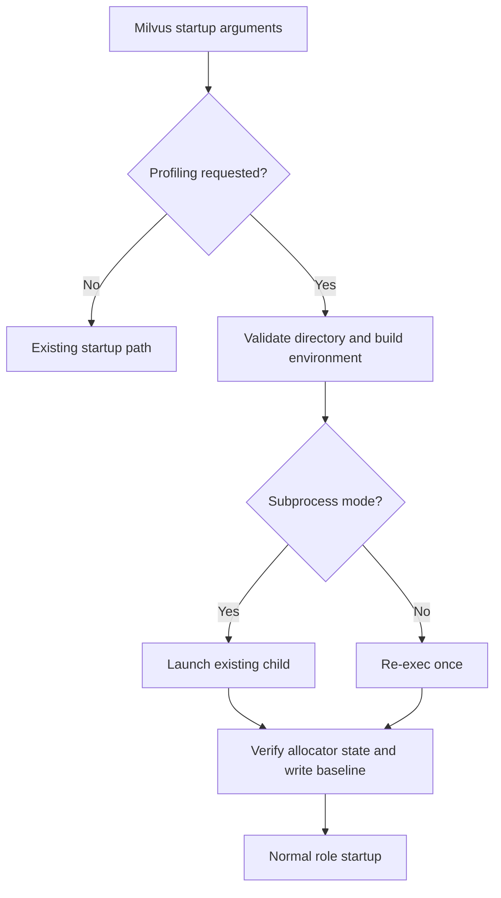

# MEP: Native Heap Profiling from the Milvus Startup Command

- **Created:** 2026-10-08
- **Author(s):** @xiaofan-luan
- **Status:** Under Review
- **Component:** QueryNode, StreamingNode, DataNode, shared startup
- **Related Issues:** [milvus-io/milvus#53985](https://github.com/milvus-io/milvus/issues/53985)
- **Released:** Not released

## Summary

Add one opt-in argument to `milvus run <role>` that enables jemalloc heap
profiling in the actual node process and selects a directory for its heap
snapshots:

```sh
milvus run querynode --native-profile=/milvus/logs
milvus run querynode --run-with-subprocess --native-profile=/milvus/logs
```

The launcher supplies profiling configuration before the node process starts.
The node verifies the effective allocator settings, writes an initial heap
snapshot, and continues its normal startup. Subsequent snapshots use jemalloc's
allocation-based interval dumping. Commands without the option retain their
existing behavior, including profiling configured externally with `MALLOC_CONF`.

## Motivation

Native C++ and Rust allocations can dominate node memory during an OOM incident.
Go heap profiles cannot attribute these allocations. jemalloc heap profiling
provides sampled allocation stacks, allowing normal, peak, and later snapshots
to be compared with `jeprof`.

Milvus already has native profiling functionality. The missing interface in
this proposal is a single startup option that configures it reliably for the
actual node, rather than requiring every operator to arrange environment
variables and launch scripts correctly. See the broader memory profiling issue
[#30610](https://github.com/milvus-io/milvus/issues/30610) and the online profiling
issue [#40730](https://github.com/milvus-io/milvus/issues/40730).

Setting `MALLOC_CONF` and continuing in the same Go process is insufficient:
jemalloc may initialize before Go package initialization or `main`. A new
process must receive the configuration in its startup environment.

## Public Interfaces

`--native-profile=<directory>` is supported by the shared `milvus run <role>`
startup path. It is a startup option, not a hot configuration item. It applies
to that process and does not enable profiling on other nodes in a deployment.

The initial implementation supports Linux builds with CGo and a loaded jemalloc
that was compiled with profiling support. Explicit requests on unsupported
builds or platforms produce a clear startup error. There is no change to the
default behavior on those platforms when the option is absent.

The directory is created if needed and must be suitable for heap snapshot files
and writable by the Milvus process. Operators should use a disk-backed mount whose retention matches
their diagnostic needs, separate from node cache directories that may be cleaned
on startup. A memory-backed volume adds to the container's memory consumption.

## Design Details

### Bootstrap

The launcher consumes the profiling option before the normal component argument
parser and before starting a component. It validates the directory, builds a
profiling environment, and generates a fresh UUID-based output prefix.

- With `--run-with-subprocess`, pass that environment to the existing child.
  Preserve the existing supervisor, signal forwarding, standard streams, and
  session cleanup behavior. For an explicit profiling request, propagate child
  failure as a nonzero exit status after cleanup; commands without the option
  retain their existing supervisor exit behavior.
- Without subprocess mode, re-execute the same executable once with the new
  environment. This preserves its PID and the existing process supervision.
- Remove the consumed option from the next argument vector. Use a private
  bootstrap marker to carry the expected settings into the new node process,
  verify them there, and prevent recursive bootstrap. The marker is consumed
  before normal component startup.



Existing flags, role selection, and executable resolution must retain their
semantics. Profiling options on commands other than `run` are rejected rather
than causing an unrelated command to restart.

### Allocator configuration

The first version uses a conservative fixed preset:

| Option | Value | Meaning |
| --- | --- | --- |
| `prof` | `true` | Enable profiling at allocator initialization. |
| `prof_active` | `true` | Start sampling immediately. |
| `prof_thread_active_init` | `true` | Activate profiling in newly created threads. |
| `lg_prof_sample` | `22` | Average sampling interval of 4 MiB of allocation activity. |
| `prof_accum` | `false` | Do not retain cumulative allocation histories indefinitely. |
| `lg_prof_interval` | `34` | Dump after approximately 16 GiB of cumulative allocation activity. |
| `prof_prefix` | `<directory>/jeprof-<startup-uuid>` | Distinguish files across process restarts. |

Preserve unrelated `MALLOC_CONF` settings. The CLI preset takes precedence for
the options it specifies, including a previously configured output prefix.
Other allocator options retain their existing values. Reject directory values
that cannot be represented safely in the comma-separated allocator configuration.

The dump interval measures allocation traffic, including allocations that have
already been freed. It does not measure wall-clock time, current live-heap
growth, or RSS. High allocation rates can therefore produce frequent dumps.

### Effective-state verification and baseline

A small Linux/CGo capability helper resolves the allocator's `mallctl` API from
the current process, without introducing a dependency on `libmilvus_core`.
The parent checks only allocator availability and compiled-in profiling support
when profiling is not yet enabled. This avoids runtime controls whose locks are
not initialized in jemalloc 5.2.1 when `opt.prof` is false.
The new node checks that profiling support exists and that its effective
profiling state, sampling interval, dump interval, accumulation mode, and prefix
match the requested preset. A loaded library or an environment variable alone
is not evidence that profiling is active.

After those checks, call `prof.dump` once to write a baseline heap file with the
unique prefix. Check that a readable jemalloc heap file was produced. This
provides immediate evidence that the profiler works and a baseline before node
collection loading or query processing. Report the effective settings, prefix,
and baseline path at startup. Errors fail the explicit profiling startup request
before the node begins serving.

The helper uses only a few allocator control calls during startup. Normal
allocation sampling and interval dumps remain jemalloc's responsibility. No
additional request-path instrumentation or background polling is introduced.

### Snapshot lifecycle and analysis

Keep completed snapshots on the selected mount and collect them through existing
diagnostic tooling. This option does not create Kubernetes volumes, perform
uploads, or implement disk rotation. Operators must bound disk use and collect
files according to their retention policy.

An OOM kill does not run an exit handler. Previously completed snapshots can
remain available on a persistent mount, but a snapshot of every transient peak
is not guaranteed. Native heap samples attribute allocations to their creation
stacks; they do not directly identify the current owner of an object or prove
that it is leaked. They also do not represent all RSS, Go-managed heap memory,
or direct file mappings. Other allocators or interceptors, such as AddressSanitizer,
can change which allocations reach jemalloc. Effective-state and baseline checks
do not replace native workload tests that establish allocation coverage.

Analyze snapshots from the same Milvus process with matching binaries, shared
libraries, and debug symbols:

```sh
jeprof --show_bytes --inuse_space --text \
    --base=baseline.heap /path/to/matching/milvus peak.heap
```

Byte values and object counts are sampling estimates. With `prof_accum:false`,
the primary use is outstanding-allocation analysis rather than complete
historical allocation traffic.

## Compatibility, Deprecation, and Migration Plan

There is no default configuration change or removal of environment-based
profiling. Existing images must be updated to a version containing the option
before it can be passed to their command line. Adding or removing the option
requires starting a new process.

There are no new HTTP endpoints, runtime activation APIs, metrics label changes,
or deployment-controller changes in this proposal. Configurable sampling presets
or additional runtime control can be considered separately.

## Test Plan

- Test argument parsing, command scoping, help text, configuration precedence,
  unrelated environment preservation, invalid directories, and fresh prefixes.
- Test both launch paths with a child process, including marker consumption,
  error propagation, and loop prevention. Preserve the existing subprocess
  signal and session cleanup behavior.
- Test unsupported platform/build behavior and each allocator verification
  failure. Commands without the new option must not perform profiler checks or
  touch the filesystem.
- On Linux, preload a profiling-enabled jemalloc, check the effective state in
  the new process, make real native allocations, and confirm that `prof.dump`
  produces a readable heap containing those allocations. Include controls with
  no allocator and profiling disabled.
- Verify that an initial snapshot and later completed snapshots survive killing
  their process when stored on the configured retained filesystem.
- Measure CPU per request, throughput, tail latency, RSS, and dump frequency and
  duration under a comparable workload with and without profiling. No universal
  performance overhead percentage is assumed.

## Alternatives Considered

Environment variables or startup-script wrappers remain valid ways to configure
jemalloc. The CLI option centralizes directory validation, configuration
propagation, unique prefixes, and effective-state verification.

Activating profiling only after a memory threshold is reached would miss earlier
allocation stacks when profiling was disabled at allocator initialization.
Runtime control is outside the initial startup milestone.

## References

- [Startup option issue](https://github.com/milvus-io/milvus/issues/53985)
- [Shared Milvus startup entry](https://github.com/milvus-io/milvus/blob/master/cmd/milvus/main_entry.go)
- [jemalloc 5.2.1 control and profiling options](https://raw.githubusercontent.com/jemalloc/jemalloc/5.2.1/doc/jemalloc.xml.in)
- [jemalloc 5.2.1 jeprof](https://github.com/jemalloc/jemalloc/blob/5.2.1/bin/jeprof.in)
